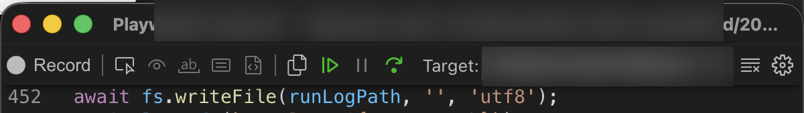
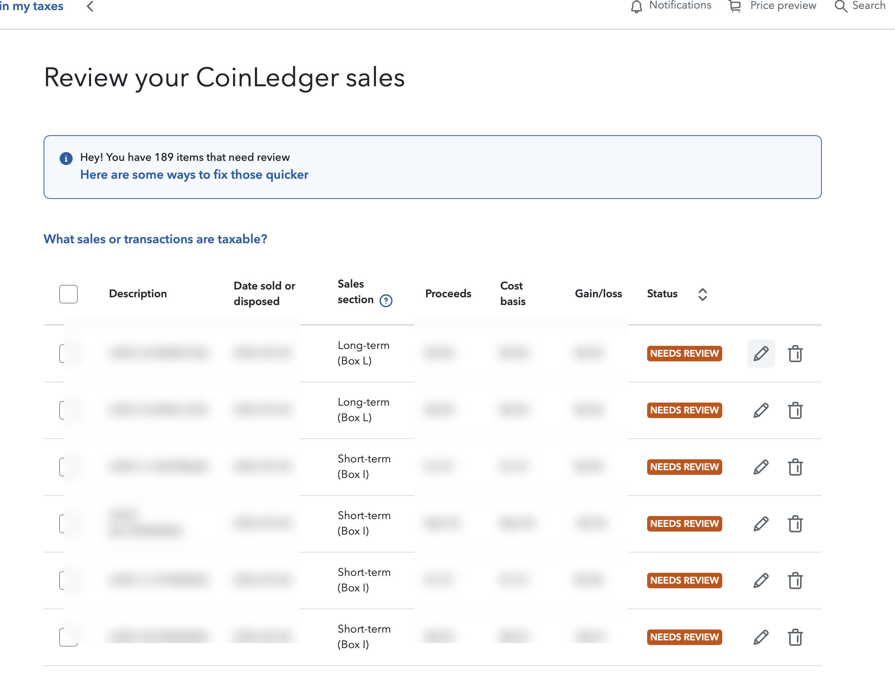
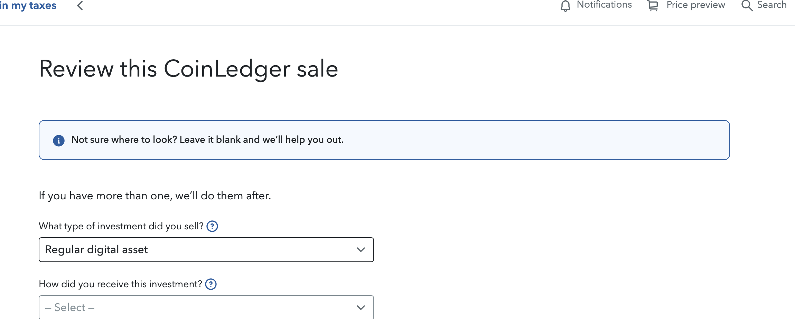
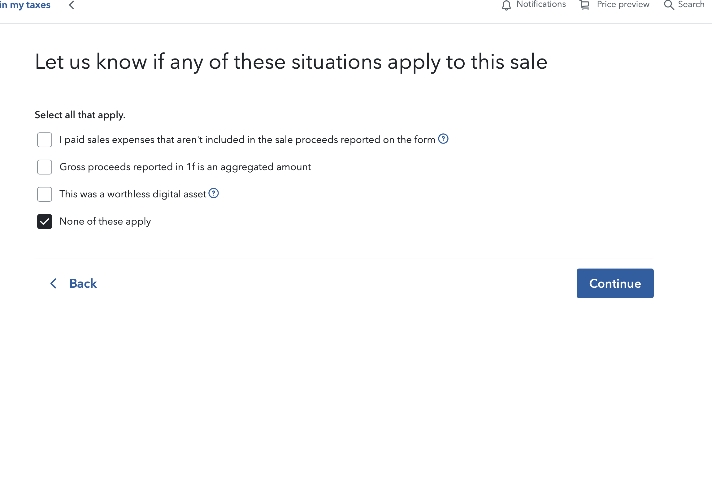
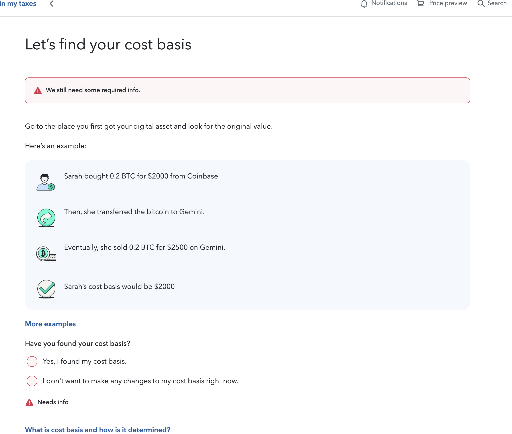

# TurboTax Crypto Transaction Reviewer

This project opens TurboTax in a browser and helps click through CoinLedger crypto transactions that are marked for manual review.

It is meant for people who are stuck reviewing a long list of transactions one by one. The script still requires you to log in to TurboTax yourself. After you reach the CoinLedger review table, the script continues the repetitive clicking for you.

## What this does

For each transaction marked `NEEDS REVIEW`, the script:

- opens the review flow
- sets the investment type
- treats `USDC` as a stablecoin
- marks the transaction as "I purchased it"
- clicks through the follow-up screens
- moves to the next page until there are no more review items
- retries a failed row once before stopping
- saves a screenshot and page HTML when a transaction fails

## Important notes

- Use this at your own risk. You are responsible for checking that the selections are correct for your tax situation.
- Read the screens in TurboTax before letting the script continue.
- This project is not affiliated with TurboTax, Intuit, or CoinLedger.
- You need an internet connection and a normal desktop browser environment.

## Before you start

You need:

- a Mac or Windows computer
- a TurboTax account
- Node.js installed
- this project downloaded onto your computer

If you do not already have Node.js:

- Go to https://nodejs.org/
- Download the `LTS` version
- Install it with the default options

## Download this project

If you already have the project folder on your computer, skip this section.

Otherwise:

1. Download the project as a ZIP from GitHub.
2. Extract the ZIP.
3. Put the folder somewhere easy to find, like your Desktop or Documents folder.

## Open Terminal

### On Mac

1. Open `Terminal`
2. Type `cd ` and then drag the project folder into the Terminal window
3. Press `Enter`

### On Windows

1. Open `PowerShell`
2. Type `cd ` followed by the path to the project folder
3. Press `Enter`

Example:

```bash
cd Desktop/turbotax_crypto_transaction_reviewer
```

On Windows the path may look more like:

```powershell
cd C:\Users\YourName\Desktop\turbotax_crypto_transaction_reviewer
```

## First-time setup

Run these commands one at a time inside the project folder.

1. Install the project packages:

```bash
npm install
```

2. Install the browser that Playwright uses:

```bash
npx playwright install chromium
```

## Run the script

Start it with:

```bash
npm start
```

What happens next:

1. A Chromium browser window opens.
2. The script goes to the TurboTax website.
3. Log in to TurboTax yourself.
4. Navigate to the `Review your CoinLedger sales` page.
5. When that page is fully open, resume the script in the Playwright inspector window.

If you are not sure where to click, use the green triangle "resume" button in the Playwright Inspector:



The script will then begin processing each transaction.

## Screens you should expect

Before you hit resume, you should already be on the transaction review table page with `NEEDS REVIEW` rows visible and pencil icons on the right side of the table.



After you resume, the script opens each row and fills the two dropdowns on the `Review this CoinLedger sale` screen.



You may then see the follow-up checklist screen. The script selects `None of these apply` and continues.



Sometimes TurboTax also shows the cost basis screen. When it appears, the script selects `I don't want to make any changes to my cost basis right now` and continues.



While it runs, the terminal will show:

- which row it is opening
- how many transactions have been completed
- how many retries have been used
- the asset name for completed rows when available

At the end of a successful or failed run, the script also prints a summary with:

- how many rows were corrected
- how many rows remain
- how many retries were used
- total runtime
- average time per corrected row

The same messages are also written to a timestamped run log in `.artifacts/`, for example:

```text
.artifacts/run-2026-03-22T05-30-00-000Z.log
```

## How to stop it

- In the Terminal or PowerShell window, press `Ctrl + C`
- You can also close the automated browser window

## If something does not work

Try these steps:

1. Close the browser window.
2. Go back to your Terminal or PowerShell window.
3. Press `Ctrl + C` to stop the script.
4. Run `npm start` again.

If the page layout in TurboTax has changed, the script may need to be updated.

If a run fails, diagnostic files are written to `.artifacts/`:

- a timestamped run log
- a full-page screenshot
- the current page HTML

These files help you see exactly what TurboTax showed when the script stopped.

## Customize the field logic

The easiest place to change the business rules is near the top of [scripts/turbotax-review-helper.js](scripts/turbotax-review-helper.js) in the `FIELD_LOGIC` object.

Right now it controls the two fields this script updates:

- `determineInvestmentType({ assetName })`
- `determineHowReceived(...)`

Default behavior:

- if the asset name contains `USDC`, the script selects `Stablecoin`
- otherwise it selects `Regular digital asset`
- for how the investment was received, it selects `I purchased it`

Example customization:

```js
const FIELD_LOGIC = {
  determineInvestmentType({ assetName }) {
    if (assetName.toUpperCase().includes('USDC')) {
      return 'Stablecoin';
    }

    if (assetName.toUpperCase().includes('NFT')) {
      return 'NFT';
    }

    return 'Regular digital asset';
  },

  determineHowReceived({ assetName }) {
    if (assetName.toUpperCase().includes('BONUS')) {
      return 'I received it as a gift';
    }

    return 'I purchased it';
  }
};
```

Rules for custom logic:

- return the exact visible option text that appears in the TurboTax dropdown
- keep the function deterministic
- only change the fields you intend to automate
- restart the script after editing the file so the new logic is loaded

## Files in this project

- `scripts/turbotax-review-helper.js`: the automation script
- `package.json`: the project dependency list
- `.gitignore`: tells Git which local files should not be tracked
